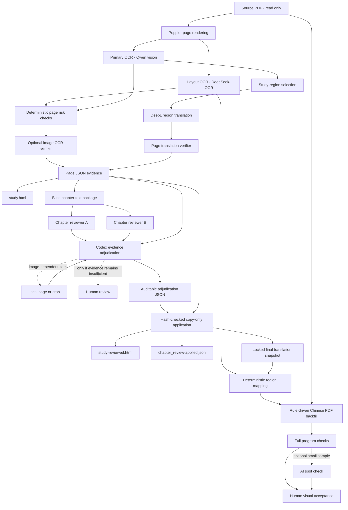

# Beast Academy OCR与学习翻译设计

## 1. 文档职责

本文档记录系统边界、数据流、可审计规则和已验证决策。README负责“怎么运行”，
`AGENTS.md`负责“未来代理允许做什么”，三者不重复。

## 2. 目标与非目标

目标：

- 为小学生个人学习提供准确、简洁、自然的中文对照；
- 保留PDF、OCR、翻译、复核和最终裁决的完整证据链；
- 由Codex对多模型候选做证据裁决，不使用简单多数票；
- 只把Codex查看上下文和必要图像后仍无法决定的项目交给人工。

非目标：

- 不制作或发布可替代原书的中文商业版；
- 不自动解题，不改变数字、公式、条件或答案；
- 不在未验证时覆盖原页面JSON或既有学习页。

## 3. 内容选择规则

| 模式 | 用途 | 保留 | 主动跳过 |
|---|---|---|---|
| `exact` | 完整英文底稿 | 页面全部可见文字 | 无 |
| `study` | 小学生学习 | 对白、问题、指令、解释、定义、标题/目录、图注、脚注 | 拟声词、页脚页码、纯数字表、纯公式、独立边长/图形标注、划掉草稿 |

数字、公式或单位如果嵌入问句或解释，`study`仍必须保留。百数表和纯几何标注
由原图承载，无需重复翻译。

## 4. 总体数据流

独立Mermaid源文件：[`docs/ocr-pipeline.mmd`](docs/ocr-pipeline.mmd)。

核心原则是“证据只追加，原结果不静默改写”。整章复核、Codex裁决和最终学习页
都作为独立派生物保存。

## 5. 处理阶段

### 5.1 渲染与双路OCR

1. Poppler将PDF单页渲染为默认长边2048像素的PNG。
2. DeepSeek-OCR精细定位提取文字区域和坐标。
3. Qwen视觉模型输出主英文或`study`结构化区域。
4. 同页两路OCR并发；页级并发默认为2，上限为4。

主OCR是页面英文权威来源。坐标OCR和独立图像复核只提供风险证据，不自动替换主文本。

### 5.2 翻译与逐页复核

1. `study`区域逐条发送给DeepL Remote MCP，使用同页相邻文本作为上下文。
2. 翻译通过区域ID合并，不依赖可能被改写的批量分隔符。
3. 逐页文本模型复核数学含义、术语、双关、数字和遗漏，但只产生候选。
4. `--reverify-translation`只读已保存的英中文，不读图、不重做OCR、不调用DeepL。

### 5.3 整章文本盲审

`--export-chapter-review`生成不含图片和既有候选的整章输入，包含压缩术语表、角色名、
标题/目录、重复表达和全部英中对照。排除既有候选可减少锚定。

`--chapter-review`对同一份输入依次运行`model_usage.chapter_review`选中的多个文本模型。
每个结果按资料名独立保存；比较报告只统计候选数和区域重合，不做多数票合并。

### 5.4 Codex最终裁决

Codex读取整章报告、原英文、当前译文、紧邻上下文和术语表，对每个候选直接决定：

| 决定 | 含义 | 后续 |
|---|---|---|
| `replace` | 译文有实质错误或不适合小学生 | 使用Codex最终译文 |
| `normalize` | 术语、角色名或重复表达不一致 | 按全章规则统一 |
| `discard` | 复核模型误报 | 保留当前译文 |
| `needs_human` | 补充上下文和图像后仍缺少决定性证据 | 交给人工 |

对依赖图形、气泡归属或旋转/翻转的候选，Codex先查看局部图或整页图。
人工复核不是必经阶段，清单可以为空。

当前局限：`ocr_demo.py`已能验证和应用已保存的Codex裁决JSON，但不会自动调用
Codex API生成裁决文件；当前由Codex任务读取结果后生成。

### 5.5 生成裁决版

`--build-reviewed-study`会验证裁决输入SHA-256、所有`page + region id`及决定类型，
深拷贝页面记录，并只写出`study-reviewed.html`和`chapter_review-applied.json`。
`discard`的最终译文必须与当前译文相同。原页面JSON、`manifest.json`、`study.html`和PDF不变。

### 5.6 最终译文快照与PDF回填

`--build-final-translation`将页面JSON中的全部区域、Codex裁决和可选人工译文覆盖
合并为`chapter_translation_final.json`。优先级是“人工覆盖 > Codex裁决 > 已保存
页面译文”。快照记录每条译文来源和输入哈希并标记为锁定；回填阶段不得自行改译文。

`--export-pdf chinese`读取锁定快照和DeepSeek-OCR的0–1000坐标，保留原PDF页面，
使用邻近颜色近似覆盖英文，再叠加中文字体。当前目标是个人学习可用而非出版级复刻：

- 允许文字越出气泡，但不得完全落到页面外；
- 不要求零英文，未定位区域按规则保留；
- 背景修复允许轻微色差、纹理差异和边缘瑕疵；
- `child_note`第一版不写入原气泡；
- 每个布局OCR项只能归属一个译文区域，映射歧义时只保留最可靠的单个空间连通区；
- 中文使用独立STHeiti TrueType字体嵌入，不使用会导致PDFKit乱码的PingFang TTC；
- 每个文本框根据换行数和可用高度独立调整字号，默认最多缩小1点，宽度扩张只作为小范围补充；
- 同一译文的多个擦除框统一使用各框背景采样的通道中位色，不对每行分别填充不同颜色；
- 低覆盖率和低覆盖率歧义匹配默认保留英文；密集几何图解中的高置信度定义和图形标签允许回填，但不放宽覆盖率和歧义门槛；
- 全局规则位于`pdf_backfill.rules`，与模型资料和用途映射解耦；
- 人工发现的局部问题通过独立覆盖文件修正，不写回OCR和裁决证据。

质量链路是“程序全量检查 -> AI可选抽查 -> 人工视觉验收”。程序负责PDF可重开、
页数尺寸、非空页、区域计数、最终译文锁定、嵌入字体类型、布局坐标唯一归属、
严重文本框相交和异常清单。AI不重复程序检查、不自动
全章视觉复核，只在用户要求时查看程序异常或少量代表页。最终视觉接受只能由人工确认。
子集试导出依然先在整章范围验证并应用裁决，再过滤到指定页，所有产物自动使用
`-pages-<页码>`后缀，不覆盖整章文件。

## 6. 小学生译文标准

裁决顺序：数学正确、容易理解、中文自然、全章一致、必要笑点得以保留。
忠实不等于逐字直译。例如`No triangle can have more than one right angle`宜译为
“一个三角形最多只能有一个直角”。

译文和教学补充必须分开：`final_translation`忠实表达原文；`child_note`只在有助理解时增加，
不写回原译文。

## 7. 模型与配置解耦

配置分为`api_keys`密钥表、`model_profiles`模型资料和`model_usage`用途映射。
切换OCR或复核模型只改用途映射，不复制密钥、端点或模型ID。

| 用途 | 作用 | 默认资料 |
|---|---|---|
| `layout_ocr` | 坐标OCR | `deepseek-ocr` |
| `primary_ocr` | 主英文/`study`区域 | `qwen-flash` |
| `ocr_verifier` | 风险页图像复核 | `qwen-max` |
| `qwen_translation` | 备用翻译 | `qwen-flash` |
| `translation_verifier` | 逐页英中复核 | `qwen-max` |
| `chapter_review` | 整章盲审，可多选 | `qwen-max` |

Qwen思考开关使用`enable_thinking`，DeepSeek使用`thinking.type`。DeepSeek V4整章复核
默认关闭思考，避免输出预算全部消耗在reasoning token而没有最终JSON。

## 8. 主要产物

| 文件 | 性质 | 更新规则 |
|---|---|---|
| `pages/page-NNNN.json` | 页级OCR、翻译和复核证据 | 只由对应维护模式更新 |
| `study.html` | 当前原始翻译汇总 | 维护模式可重建 |
| `chapter_review_input.md` | 整章盲审输入 | 导出/整章复核时重建 |
| `chapter_review-<profile>.json/.md` | 单模型整章报告 | 重跑该资料时 |
| `chapter_review-codex-adjudication.json` | Codex最终决定 | 只在新裁决中 |
| `chapter_review-applied.json` | 裁决应用审计记录 | 重建裁决版时 |
| `study-reviewed.html` | 面向小学生的最终页 | 重建时；不影响`study.html` |
| `chapter_translation_final.json` | 完整且锁定的最终译文快照 | 每次回填前重建 |
| `pdf_backfill_plan.json` | 英文区域、坐标、置信度和异常 | 每次回填时重建 |
| `pdf_backfill_report.json` | 程序全量技术检查 | 每次回填后重建 |
| `ai_spotcheck_request.json` | 可选AI抽查清单，不触发模型 | 每次回填后重建 |
| `*-zh-review.pdf` | 待人工视觉检查的纯中文版 | 不覆盖原PDF |

输出可保存平台、模型ID、状态、耗时和Token，但不保存密钥、Authorization头、
DeepL密码或OAuth令牌。

## 9. 可恢复性与安全

- 非空输出目录默认拒绝新任务覆盖；页面JSON和Markdown使用原子替换；
- `--resume --redo-pages`只重做指定页；`--reanalyze`、`--retranslate`和`--reverify-translation`分层维护；
- 局部维护后与既有页合并，不把总汇总缩成子集；
- PDF始终只读；`ocr_config.json`和`runs/`即使已忽略也仍按敏感数据处理；
- DeepL密码只输入官方OAuth页；OAuth数据编码保存在已被Git忽略的`.env`
  `DEEPL_OAUTH_CREDENTIALS`中，刷新时自动更新，且不写入日志；
- 只重试限流、超时和服务器错误，不对参数或认证错误盲目重试。

## 10. 已验证决策

### 10.1 24页扩展样本（2026-08-23）

样本覆盖目录、索引、普通/黑底漫画、手写字、定义页、百数表和几何图；
359个英中条目通过当时自动检查。这是覆盖性验证，不是有标准答案的准确率测试。

### 10.2 第1章整章试验（2026-08-23）

- PDF第13–42页，341个英中区域；逐页复核生成75个偏高召回候选；
- Qwen Max整章盲审8个问题、2个全局项；DeepSeek V4 Pro关闭思考后为32个问题、3个全局项；
- 并集为35个区域候选，另有14个全局一致性定位；
- Codex裁决49个区域：22个`replace`、25个`normalize`、2个`discard`；
- 47处实际变更，人工清单为0；用户已完成最终人工检查，未报告新问题。

结论：Qwen更保守，DeepSeek召回更高但会把一个全局问题展开为多条；
Codex适合做证据裁决和去重。

### 10.3 DeepSeek决策

- `deepseek-v4-flash-vision-exp`的代表图测试出现改写、重复、漏小数字和不存在的对白，
  不用于主OCR、图像复核或坐标提取；
- `deepseek-v4-pro`作为整章文本复核具有补漏价值；
- DeepSeek V4默认开启思考，当前结构化整章复核必须发送`thinking.type=disabled`。

## 11. 验证分层

- 语法检查：Python可编译；
- 单元测试：规则、解析、合并和不可变性通过本地测试；
- 配置检查：JSONC、模型资料和用途映射可解析；
- 干跑：本地工具、页码和密钥配置完整，不代表外部API正常；
- 端到端：用户实际运行并产生可验证输出；
- PDF程序检查：全量检查结构、页数、尺寸、非空、字体执行和区域计数；
- AI抽查：仅分析程序异常或少量高风险页，不重复全量检查；
- 人工验收：用户检查实际学习页和PDF视觉效果。

本地mock或语法通过不得表述为外部模型已验证。

## 12. 后续路线

1. 固化Codex裁决输入包与JSON Schema，但保留Codex直接决策权。
2. 只对Codex判定依赖图像的候选生成局部截图。
3. 只在`needs_human > 0`时生成人工页。
4. 建立小型标准集，分开测量文本召回率、OCR准确性和译文正确性。
5. 全书扩展前再用1–2个风格不同的章节验证术语传递和成本。
6. 纯中文版由人工完成视觉验收后，再实现“原英文页、中文页交替”的双语版。
