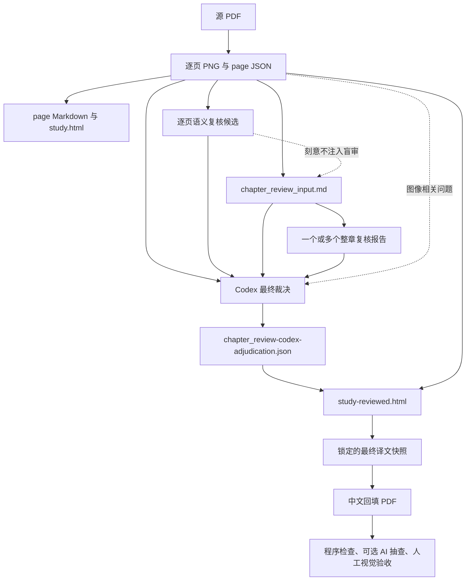

# OCR、学习翻译与最终裁决主流程

## 1. 文档目的

本文按阶段说明从源 PDF 到学习译文、整章复核、Codex 最终裁决和中文 PDF
回填的主流程，重点列出：

- 每个阶段做什么；
- 读取哪些上一阶段产物；
- 调用哪些模型或外部服务；
- 使用什么命令；
- 生成哪些新产物；
- 上下文如何在阶段间传递，以及哪些信息被刻意隔离。

示例以 Windows PowerShell、PDF 页码 `13-42` 和输出目录
`runs/chapter1-study-01` 为例。实际执行时，后续阶段必须继续使用同一份 PDF、完整章节页码、
配置和输出目录。只处理第 53 页时，可把页码和输出目录分别替换为 `53` 和
`runs/study-batch-01`，但这不再具备真正的整章上下文。

## 2. 总体原则

1. 源 PDF、逐页 JSON、`manifest.json` 和原始 `study.html` 是不可静默改写的证据。
2. 主 OCR 的英文是权威来源；坐标 OCR 和图像复核只提供定位或风险证据。
3. 逐页语义复核和整章盲审只产生候选，不自动覆盖当前译文。
4. 整章盲审不读取已有逐页复核建议，避免模型被先前意见锚定。
5. Codex 同时读取逐页候选、整章候选、原文、当前译文、上下文和术语表后直接裁决，
   不使用多数票。
6. 人工复核只接收 Codex 补充必要证据后仍无法判断的项目，清单可以为空。
7. PDF 回填只能读取锁定的最终译文快照，不得自行修改译文。
8. PDF 的程序检查通过只表示 `program_checked`，最终视觉接受仍由用户确认。

## 3. 配置分层

配置中的三类信息保持解耦：

| 配置层 | 作用 | 示例 |
|---|---|---|
| `.env` | 保存平台密钥和 DeepL OAuth 凭据 | `SILICONFLOW_API_KEY`、`DASHSCOPE_API_KEY` |
| `model_profiles` | 定义平台、真实模型 ID、端点、思考开关和 Token 上限 | `deepseek-ocr`、`qwen-flash`、`qwen-max` |
| `model_usage` | 把处理用途映射到某个模型资料 | `primary_ocr: qwen-flash` |

切换模型通常只改 `model_usage`，不复制或移动密钥。主要用途如下：

| 用途 | 配置项 | 示例资料 | 说明 |
|---|---|---|---|
| 坐标和版面 OCR | `model_usage.layout_ocr` | `deepseek-ocr` | 提供文字区域和 0–1000 坐标 |
| 主 OCR | `model_usage.primary_ocr` | `qwen-flash` | 输出权威英文或 `study` 区域 |
| 图像 OCR 复核 | `model_usage.ocr_verifier` | `qwen-max` | 由 `--verify` 控制是否调用 |
| Qwen 翻译 | `model_usage.qwen_translation` | `qwen-flash` | 仅当 `translation.provider=qwen` 时使用 |
| 逐页翻译语义复核 | `model_usage.translation_verifier` | `qwen-max` | 由 `translation_verify` 控制 |
| 整章文本盲审 | `model_usage.chapter_review` | `qwen-max`、`deepseek-v4` | 数组，可独立运行多个模型 |

Qwen 的思考开关通过 `enable_thinking` 发送；DeepSeek 则由程序转换为
`thinking.type` 协议字段。

## 4. 主流程总览



## 5. 分阶段说明

### 阶段 0：配置和本地预检查

**做什么**

- 解析配置和命令行参数；
- 检查模型用途映射、路径和必要字段；
- 不调用 OCR、翻译或外部复核模型。

**输入**

- `ocr_config.json`
- `.env`
- 源 PDF 路径和目标页码

**模型或服务**

- 无调用。

**命令示例**

```powershell
python .\ocr_demo.py --config .\ocr_config.json --dry-run
```

**输出**

- 终端配置摘要；
- 不生成正式 OCR 产物。

### 阶段 1：页面渲染、双路 OCR 与学习区域提取

**做什么**

1. Poppler 把 PDF 页面渲染为 PNG；
2. 版面 OCR 提取文字框和坐标；
3. 主 OCR 输出英文和结构化学习区域；
4. 按 `--verify auto|always|never` 选择是否调用独立图像 OCR 复核；
5. 执行确定性的页级风险检查。

`study` 模式只选取对白、问题、指令、解释、定义、标题、图注等学习内容；拟声词、
独立页码、纯数字表、纯公式和独立边长等默认跳过。

**读取上一阶段产物**

- 源 PDF；
- 已解析的配置。

**模型或服务**

- `model_usage.layout_ocr`
- `model_usage.primary_ocr`
- 可选 `model_usage.ocr_verifier`
- Poppler 不是模型，只负责页面渲染。

**命令示例**

```powershell
python .\ocr_demo.py `
  --config .\ocr_config.json `
  --pdf '.\book\beast academy math guide 3A.pdf' `
  --pages '13-42' `
  --output '.\runs\chapter1-study-01' `
  --mode study `
  --workers 2 `
  --verify auto
```

**主要产物**

- `pages/page-NNNN.png`：渲染页图；
- `pages/page-NNNN.json`：该页完整机器可读证据；
- `manifest.json`：批次清单；
- `summary.md`：批次摘要；
- 日志文件。

### 阶段 2：逐区域翻译与逐页语义复核

**做什么**

1. 把每个学习区域分别翻译；
2. 使用区域 ID 合并英中结果；
3. 每个区域可携带最多 300 字符的同页相邻文本，帮助理解短标签；
4. 当 `translation_verify: always` 时，对每个成功翻译页面调用一次语义复核；
5. 语义复核只保存问题说明和建议译文，不覆盖当前译文。

首次 `study` 运行通常已经连续完成阶段 1 和阶段 2，无需再单独执行第二条命令。

**读取上一阶段产物**

- 主 OCR 输出的 `study.regions`；
- 同页邻近英文；
- 翻译约束和术语配置。

**模型或服务**

- 默认：DeepL Remote MCP；
- 如果配置为 Qwen 翻译：`model_usage.qwen_translation`；
- 逐页语义复核：`model_usage.translation_verifier`。

**维护命令示例**

只重新翻译已有英文区域，不重做图像 OCR：

```powershell
python .\ocr_demo.py `
  --config .\ocr_config.json `
  --pages '13-42' `
  --output '.\runs\chapter1-study-01' `
  --mode study `
  --retranslate
```

只重新复核已保存的英中译文，不调用 OCR 或 DeepL：

```powershell
python .\ocr_demo.py `
  --config .\ocr_config.json `
  --pages '13-42' `
  --output '.\runs\chapter1-study-01' `
  --reverify-translation
```

**主要产物**

- 更新后的 `pages/page-NNNN.json`；
- `pages/page-NNNN.md`：英文、当前中文、忽略内容和逐页语义复核建议的人类可读视图；
- `study.html`：未应用 Codex 裁决的基础学习页；
- 页面 JSON 内的 `translation_verifier_comparison.issues`；
- 发现候选时的 `translation_semantic_issue` 标记。

**关键上下文关系**

`page-NNNN.md` 不是后续机器流程的权威输入；它是同名页面 JSON 的可读视图。
逐页建议真正保存在 `page-NNNN.json` 中。建议译文只是证据，不是最终译文。

### 可选实验分支：Codex直接进行页级最终复核

`codex_page_review.py`只读取`page-NNNN.json`中的`study.regions`，并可按需读取
同名PNG，使用
本机ChatGPT登录的`codex exec`完成单页全部区域裁决。模型和推理强度由配置中的
`codex_page_review`控制，默认是`gpt-5.6-terra`和`high`。默认图片策略为
`on_demand`：第一阶段只传文本，只有明确需要视觉证据的区域才进入第二次带图调用。
Codex运行在只读沙箱；
页面Markdown、`issues`、`translation_verifier_comparison`和`study.skipped`均不作为
该分支的模型上下文。兼容参数`--page-md`只用于推导同名JSON路径，不读取Markdown。
脚本验证全部区域覆盖、输入SHA-256和原记录不变后，另存
`page-NNNN-codex-review.json`。结果同时记录Codex CLI在`turn.completed`事件中返回的
输入、缓存输入、输出、推理输出和总Token统计，并分别列出文本与可选图片阶段。
完整覆盖通过模型返回的内部
`reviewed_region_ids`验证；最终`decisions`只保存译文实际发生变化的
`replace/normalize`项，当前译文可接受的区域不输出。

```powershell
python .\codex_page_review.py `
  --config .\ocr_config.json `
  --page-json .\runs\study-batch-01\pages\page-0053.json
```

该分支不使用API Key，目前也尚未接入最终译文快照或PDF回填入口。它只有同页上下文，
不能替代阶段3至阶段5所提供的跨页一致性裁决。

### 可选实验分支：按目录拆分整书持久复核

`codex_book_review.py plan`读取用户指定的目录PDF页图片，通过本机Codex app-server
解析印刷页码、章节和小节，并生成`book-review-plan.json`。目录规则置于
developer instructions；目录元数据和图片是用户证据。封面、出版信息和目录页默认
组成独立`preliminary`任务；计划只默认把Index、Appendix、Answers和Glossary列入
`excluded_ranges`。

`codex_book_review.py review`随后读取计划和各页JSON的`study.regions`。前置内容和每个
正式章节各自使用一个持久thread；同章页面连续turn共享固定裁决规则和已有章节上下文，
检查点可在中断后恢复thread。每轮保存缓存与非缓存输入Token。该分支仍不读取页面
Markdown、逐页issues、`translation_verifier_comparison`或`study.skipped`。

```powershell
python .\codex_book_review.py plan `
  --config .\ocr_config.json `
  --pdf ".\book\beast academy math guide 3A.pdf" `
  --toc-pages 5-6 `
  --output .\runs\book-review-3A

python .\codex_book_review.py review `
  --config .\ocr_config.json `
  --pdf ".\book\beast academy math guide 3A.pdf" `
  --pages-dir .\runs\study-batch-3A\pages `
  --output .\runs\book-review-3A
```

### 阶段 3：导出整章盲审输入

**做什么**

- 从选定范围内的全部页面 JSON 汇总当前英文和当前中文；
- 添加固定术语表、翻译约束、角色名、标题、目录和重复表达；
- 刻意排除逐页语义复核候选和页面图片，减少锚定。

**读取上一阶段产物**

- `pages/page-NNNN.json` 中的 `study.regions`；
- 当前已保存的英文和中文；
- 配置中的术语及翻译约束。

它不通过 `page-NNNN.md` 取数，也不复制其中的“翻译语义复核建议”。

**模型或服务**

- 无调用。

**命令示例**

```powershell
python .\ocr_demo.py `
  --config .\ocr_config.json `
  --pages '13-42' `
  --output '.\runs\chapter1-study-01' `
  --export-chapter-review
```

**主要产物**

- `chapter_review_input.md`

导出后应先检查其中的 `### PDF 第 N 页` 范围。如果只出现一页，那么后续所谓“整章”
复核也只拥有这一页的上下文。

### 阶段 4：一个或多个模型进行整章文本盲审

**做什么**

- 对同一份 `chapter_review_input.md` 独立运行一个或多个文本模型；
- 检查译义、数学术语、名称、数字、遗漏和全章一致性；
- 验证模型输出的 `page + region id`；
- 只比较候选数量和区域重合，不按多数票合并。

**读取上一阶段产物**

- `chapter_review_input.md`

**模型或服务**

- `model_usage.chapter_review` 中列出的全部资料，例如：

```json
"chapter_review": ["qwen-max", "deepseek-v4"]
```

也可用多个 `--chapter-review-profile <资料名>` 临时覆盖用途选择。

**命令示例**

```powershell
python .\ocr_demo.py `
  --config .\ocr_config.json `
  --pages '13-42' `
  --output '.\runs\chapter1-study-01' `
  --chapter-review
```

**主要产物**

- `chapter_review-<资料名>-api.json`：原始 API 响应；
- `chapter_review-<资料名>.json`：验证后的机器可读报告；
- `chapter_review-<资料名>.md`：验证后的可读报告；
- `chapter_review-comparison.json/.md`：模型间候选覆盖比较。

页面 JSON 和当前译文在本阶段保持不变。

### 阶段 5：Codex 最终证据裁决

**做什么**

Codex 对候选并集逐项直接判断，而不是批准某个模型或进行多数票表决。裁决优先级为：

1. 数学含义正确；
2. 小学生容易理解；
3. 中文自然；
4. 全章一致；
5. 必要的双关或笑点得到保留。

裁决类型：

| 裁决 | 含义 |
|---|---|
| `replace` | 当前译文有实质问题，使用 Codex 最终译文 |
| `normalize` | 统一术语、名称或重复表达 |
| `discard` | 候选是误报，保留当前译文 |
| `needs_human` | 补充文本和图像后仍无决定性证据，列入人工清单 |

在保存格式中，前三类写入 `decisions`；`needs_human` 项写入 `human_review`。

**读取上一阶段及旁路产物**

- `chapter_review_input.md`；
- 所有 `chapter_review-<资料名>.json/.md`；
- `chapter_review-comparison.json/.md`；
- `pages/page-NNNN.json` 中的原英文、当前译文、相邻上下文和逐页语义复核候选；
- 需要时读取 `pages/page-NNNN.png` 或局部截图；
- 术语表和学习译文准则。

这一步正是两条证据链汇合的位置：

- 逐页语义建议提供局部候选和建议译法；
- 整章报告提供独立盲审和一致性证据；
- Codex 根据原文和上下文自行给出最终译文，任何建议都不是自动答案。

**模型或服务**

- 当前由 Codex 任务执行；
- `ocr_demo.py` 不会自动调用 Codex API 生成裁决文件。

**Codex 任务请求示例**

```text
请对 runs/chapter1-study-01 执行 Codex 最终裁决。读取逐页语义复核候选、
chapter_review_input.md、全部整章复核报告、当前英中译文、上下文和术语表；
图像相关项先查看页面图。验证候选并集、决定计数、page + region id 唯一性和输入
SHA-256，只生成 chapter_review-codex-adjudication.json，不修改页面 JSON、
manifest.json 或 study.html。
```

**主要产物**

- `chapter_review-codex-adjudication.json`

该文件必须记录输入文件 SHA-256、唯一的 `page + region id`、裁决、最终译文、理由、
置信度及可选 `child_note`。保存前应验证候选并集、决定计数和坐标唯一性。

### 阶段 6：应用 Codex 裁决并生成独立学习页

**做什么**

- 校验裁决文件列出的全部输入 SHA-256；
- 校验所有 `page + region id` 和裁决类型；
- 在内存深拷贝中应用 `replace` 和 `normalize`；
- `discard` 必须保持当前译文完全不变；
- 不写回页面 JSON、`manifest.json` 或原 `study.html`。

**读取上一阶段产物**

- 整书各任务下的`page-NNNN-codex-review.json`；
- `book-review-plan.json`；
- 裁决文件 `inputs.files` 中列出的原始输入；
- 全章 `pages/page-NNNN.json`。

**模型或服务**

- 无调用。

**命令示例**

```powershell
python .\ocr_demo.py `
  --config .\ocr_config.json `
  --pages '13-42' `
  --output '.\runs\chapter1-study-01' `
  --build-reviewed-study
```

**主要产物**

- `study-reviewed.html`：Codex 裁决版学习页；
- `chapter_review-applied.json`：原译文、最终译文、裁决和理由的应用审计记录。

如果任何被哈希锁定的输入在裁决后发生变化，本阶段必须停止，不能把旧裁决套用到新译文。

### 阶段 7：可选人工复核和独立覆盖

**做什么**

- 只处理 Codex `human_review` 中仍缺少决定性证据的项目；
- 人工译文修改写入配置指定的独立覆盖文件；
- PDF 坐标、字号、颜色和偏移修正写入独立布局覆盖文件；
- 不修改 OCR 证据、页面 JSON 或 Codex 原裁决。

**读取上一阶段产物**

- `chapter_review-codex-adjudication.json` 的 `human_review`；
- 必要页面图、上下文和原 PDF；
- `study-reviewed.html`。

**模型或服务**

- 默认无模型调用；由用户人工判断。

**主要产物**

- 可选人工译文覆盖 JSON；
- 可选 PDF 布局覆盖 JSON。

如果 `human_review` 为空，本阶段可以跳过。

### 阶段 8：生成锁定的最终译文快照

**做什么**

- 合并全部区域的最终译文；
- 应用优先级：`人工覆盖 > Codex 裁决 > 页面已保存译文`；
- 记录每条译文来源、页面记录哈希和裁决来源；
- 将结果锁定为 PDF 回填唯一可读的译文输入。

**读取上一阶段产物**

- 全部页面 JSON；
- `chapter_review-codex-adjudication.json`；
- 可选人工译文覆盖文件。

**模型或服务**

- 无调用。

**命令示例**

```powershell
python .\codex_book_finalize.py `
  --config .\ocr_config.json `
  --book-review-dir .\runs\book-review-3A
```

**主要产物**

- `book-codex-adjudication.json`；
- `chapter_translation_final.json`；
- `pdf_backfill_plan.json`。

### 阶段 9：外部擦除、中文 PDF 回填与程序全量检查

**做什么**

- `erase_english_from_deepseek.py`预先生成`page-NNNN.cleaned.png`；
- 纯写入器读取锁定译文快照和坐标计划；
- cleaned PNG作为翻译页底图，写入器只叠加中文，不执行mask、redaction或inpaint；
- 翻译范围外页面从原PDF原样复制，保持整书页数；
- 对全部输出页面执行结构、字体、坐标唯一性、相交、非空页等程序检查；
- 生成少量高风险页的 AI 抽查请求，但不自动调用 AI。

**读取上一阶段产物**

- 源 PDF；
- `chapter_translation_final.json`；
- `pdf_backfill_plan.json`；
- `page-NNNN.cleaned.png`；
- `pdf_translation_writer.rules`；
- 可选布局覆盖文件。

**模型或服务**

- 无 OCR、翻译或复核模型调用；
- 擦除阶段使用OpenCV；纯写入阶段只使用PyMuPDF、Pillow和字体处理。

**命令示例**

```powershell
python .\pdf_translation_writer.py `
  --config .\ocr_config.json `
  --cleaned-pages-dir .\runs\study-batch-3A\erase
```

`pdf_translation_writer.py`不会重建或修改译文快照。阶段8必须先完成并锁定，英文擦除
也必须在写入前独立完成。

**主要产物**

- 中文回填 PDF；
- `chapter_translation_final.json`；
- `pdf_backfill_plan.json`；
- `pdf_backfill_report.json`；
- `pdf_translation_writer_report.json`。

### 阶段 10：可选 AI 抽查与人工视觉验收

**做什么**

1. 先确认 `pdf_backfill_report.json` 的程序检查结果；
2. 用户需要时，按 `ai_spotcheck_request.json` 抽查少量高风险页；
3. 用户浏览最终 PDF，确认文字大小、遮盖、气泡归属和整体可读性；
4. 发现局部问题时更新独立覆盖文件，再重建 PDF。

**读取上一阶段产物**

- 中文回填 PDF；
- `pdf_backfill_report.json`；
- `ai_spotcheck_request.json`；
- 可选局部覆盖文件。

**模型或服务**

- AI 抽查可选，并且只检查程序报告建议的少量页面；
- 最终视觉接受必须由用户完成。

**主要产物**

- 用户的最终视觉接受结论；
- 如有必要，更新后的独立覆盖文件和重新生成的 PDF。

## 6. 关键产物之间的上下文关系

| 产物 | 直接来源 | 是否包含逐页复核建议 | 后续用途 |
|---|---|---:|---|
| `page-NNNN.json` | OCR、翻译、逐页复核 | 是 | 全流程机器可读页面证据 |
| `page-NNNN.md` | 同名页面 JSON | 是 | 人工阅读，不是机器权威输入 |
| `page-NNNN-codex-review.json` | 页面JSON的`study.regions`、可选PNG和本机Codex | 已形成页级决定 | 实验性独立结果，尚未接入PDF回填 |
| `book-review-plan.json` | 用户指定的目录页图片、PDF页数和本机Codex | 只含章节切分，不含译文建议 | 整书任务范围、页码映射和排除范围 |
| `chapters/<task-id>/page-NNNN-codex-review.json` | 计划、页面`study.regions`、可选PNG和章节持久thread | 已形成页级决定 | 整书实验性独立裁决结果 |
| `study.html` | 页面 JSON 的当前译文 | 可展示页面状态，但未应用 Codex 裁决 | 基础学习页 |
| `chapter_review_input.md` | 页面 JSON 的当前英中正文、术语和统计 | 否，刻意排除 | 独立整章盲审输入 |
| `chapter_review-<资料名>.json/.md` | `chapter_review_input.md` | 模型独立产生的新候选 | Codex 证据 |
| `chapter_review-comparison.json/.md` | 多份整章报告 | 只比较覆盖，不合并 | Codex 证据和审计 |
| `chapter_review-codex-adjudication.json` | 逐页候选、整章候选、正文上下文、术语、必要图像 | 综合两条证据链 | 唯一最终裁决来源 |
| `study-reviewed.html` | 页面 JSON 的内存副本 + Codex 裁决 | 已应用最终裁决 | 人工阅读裁决版 |
| `chapter_translation_final.json` | 页面译文 + Codex 裁决 + 可选人工覆盖 | 已锁定最终译文 | PDF 回填唯一译文输入 |
| `page-NNNN.cleaned.png` | 页面图 + `erase_english_from_deepseek.py` | 无译文 | 纯写入器的翻译页底图 |
| 中文回填 PDF | cleaned PNG + 原PDF未翻译页 + 锁定快照 + 坐标规则 | 不再判断译文 | 最终视觉验收对象 |

## 7. 第 53 页示例

当前 `runs/study-batch-01` 中：

- `pages/page-0053.md` 展示 9 条当前译文和 6 条逐页语义复核建议；
- `pages/page-0053.json` 保存相同英中正文以及机器可读的逐页候选；
- `chapter_review_input.md` 只复制第 53 页的当前英文和当前中文，不复制那 6 条建议；
- 整章模型因此可以独立发现 `r009` 等问题；
- Codex 最终裁决时再同时读取逐页候选、整章报告和原始上下文。

如果 `chapter_review_input.md` 只有 `### PDF 第 53 页`，后续只能得到单页高上下文复核，
不能检查跨页术语、角色名或重复表达的一致性。要做整章最终裁决，应先用完整章节页码重新执行
阶段 3 和阶段 4。

## 8. 推荐的完整执行顺序

```text
配置 dry-run
→ study 模式渲染、OCR、翻译、逐页语义复核
→ 检查页面 JSON、Markdown 和基础 study.html
→ 导出完整章节 chapter_review_input.md
→ 检查输入实际覆盖的页码
→ 运行一个或多个整章盲审模型
→ Codex 综合逐页与整章证据，生成带哈希的裁决 JSON
→ 生成独立 study-reviewed.html 和应用审计记录
→ 可选人工复核
→ 独立整合并生成锁定快照和坐标计划
→ 独立擦除英文并生成cleaned PNG
→ 纯写入中文 PDF 并执行程序全量检查
→ 可选 AI 小样本抽查
→ 用户完成最终视觉验收
```
