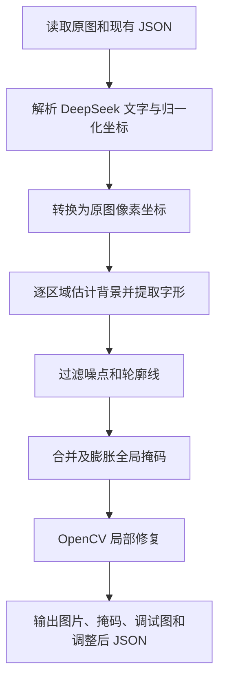

# 英文文字抹除工具设计与使用说明

## 1. 文档概述

本文档说明 `erase_english_from_deepseek.py` 的设计目标、输入输出数据结构、文字掩码生成方法、图像修复流程、运行方式、参数调优方法和已知限制。

工具用于处理已经通过 DeepSeek-OCR 精细定位的漫画、绘本或扫描页面。它从现有 JSON 的 `layout.content` 中读取文字及坐标，在原图上生成字形级掩码，然后使用 OpenCV 修复被文字覆盖的背景。

当前版本不运行 PaddleOCR、Tesseract 或其他补充 OCR。DeepSeek-OCR 没有定位到的文字不会被处理。

## 2. 设计目标

### 2.1 主要目标

- 直接复用已有 DeepSeek-OCR 结果，避免重复 OCR。
- 支持白色、浅色和彩色气泡中的黑色文字。
- 支持图表中的蓝色、红色、绿色、紫色等彩色文字。
- 尽量只抹除字形像素，保留气泡边线、图表轮廓和背景纹理。
- 将 DeepSeek 的归一化坐标转换为原图像素坐标。
- 在运行时生成结构化的调整后 JSON，便于后续翻译、排版和人工复核。
- 默认保留页面底部居中的纯数字页码。
- 输出掩码图和调试图，便于检查误删、漏删和坐标偏差。

### 2.2 当前不包含的能力

- 不执行 OCR 补检。
- 不自动发现 `layout.content` 中不存在的文字。
- 不使用生成式图像模型或 LaMa 等深度学习修复模型。
- 不负责将中文翻译重新排版到气泡中。
- 不提供目录批处理入口，每次命令处理一张图片和一个 JSON。
- 不保证区域类别在所有漫画版式下都能准确识别；区域类别当前主要用于调试和元数据记录。

## 3. 系统组成

工具采用单文件 Python 实现，主要依赖：

- Python：建议 3.9 或更高版本。
- NumPy：矩阵和像素计算。
- OpenCV：颜色空间转换、连通域分析、掩码处理、图像修复和文件输出。

整体处理流程如下：



## 4. 输入设计

### 4.1 原始图片

通过 `--image` 指定原始页面图片。

支持 OpenCV 能读取的 PNG、JPG 等常见图片格式，脚本对以下图像通道进行处理：

- 单通道灰度图：转换为 BGR 后处理。
- 三通道图：按 BGR 处理。
- 四通道图：处理 BGR 三通道，并在输出时恢复原 Alpha 通道。

### 4.2 现有 OCR JSON

通过 `--json` 指定 DeepSeek-OCR 已处理的 JSON。

JSON 根节点必须为对象，并至少包含：

```json
{
  "layout": {
    "provider": "siliconflow",
    "model": "deepseek-ai/DeepSeek-OCR",
    "content": "<|ref|>Shapes<|/ref|><|det|>[[568, 30, 644, 52]]<|/det|>"
  }
}
```

脚本从 `layout.content` 中解析以下结构：

```text
<|ref|>文字内容<|/ref|><|det|>[[x1, y1, x2, y2]]<|/det|>
```

其中：

- `ref` 是 OCR 识别文字。
- `det` 是文字区域矩形。
- 默认坐标空间为横纵坐标均处于 `0～1000` 的归一化坐标系。
- 可以通过 `--coordinate-max` 修改坐标最大值。

### 4.3 坐标转换

假设原图尺寸为：

```text
width  = W
height = H
```

归一化坐标最大值为 `M`，则像素坐标转换公式为：

```text
x_pixel = round(x_normalized × W / M)
y_pixel = round(y_normalized × H / M)
```

以 `page-0030` 为例：

```text
原图尺寸：1552 × 2048
Shapes：[[568, 30, 644, 52]]
```

转换结果约为：

```text
[882, 61, 999, 106]
```

转换后的坐标会裁剪到图片有效范围，并确保矩形至少包含一个像素。

## 5. 核心算法设计

### 5.1 DeepSeek 区域解析

脚本使用正则表达式解析 `layout.content`，将每个有效区域转换为内部结构：

```json
{
  "id": "ds-0001",
  "text": "Shapes",
  "bbox_norm": [568, 30, 644, 52]
}
```

区域编号按照 `layout.content` 中的出现顺序生成。

如果一个 `det` 中存在多个合法矩形，脚本会将每个矩形作为独立区域处理。

### 5.2 区域安全扩展

DeepSeek 的定位框可能比实际字形略窄，例如首字母或句末标点可能超出原框。脚本根据文字框高度 `h` 对处理区域进行扩展：

```text
横向字形捕获扩展：max(4, round(h × 0.80))
纵向字形捕获扩展：max(2, round(h × 0.12))
```

背景采样区域比字形捕获区域更大：

```text
横向背景采样扩展 = 横向字形扩展 + max(3, round(h × 0.10))
纵向背景采样扩展 = max(纵向字形扩展 + 3, h × padding_ratio)
```

采用横向大、纵向小的扩展策略，是为了捕获框外的首尾字符，同时降低相邻文字行进入同一处理区域的概率。

### 5.3 局部背景估计

文字通常只占扩展区域的一部分，因此脚本将扩展区域所有像素的分量中位数作为局部背景近似值：

- Lab 中位颜色：用于检测彩色文字与背景的颜色差异。
- 灰度中位值：用于检测明显比背景暗的黑色或深色文字。

中位数比均值更不容易受到少量深色文字、彩色笔画和扫描噪点的影响。

### 5.4 自适应颜色距离阈值

脚本计算每个像素与局部背景 Lab 颜色的欧氏距离：

```text
distance = ||pixel_lab - background_lab||
```

随后使用中位数和 MAD 计算鲁棒阈值：

```text
robust_sigma = max(1, 1.4826 × MAD)
threshold = min(65, max(min_color_distance, median + 4 × robust_sigma))
```

这样可以在浅色扫描纹理和彩色文字之间取得平衡：

- 阈值不会低于 `--min-color-distance`。
- 阈值最高限制为 65，避免彩色文字因为背景纹理较强而完全漏掉。

### 5.5 字形候选生成

一个像素满足以下任一条件时，进入初始字形候选：

```text
Lab 颜色距离达到自适应阈值
或者
灰度值 <= 局部背景灰度 - dark_delta
```

对应逻辑为：

```text
candidate = color_ink OR dark_ink
```

因此该方法能够同时处理：

- 白色或浅色气泡中的黑色文字。
- 浅粉、浅黄、浅蓝气泡中的深色文字。
- 图表中的蓝色、红色、绿色、紫色文字。

### 5.6 连通域过滤

扫描图片可能产生纸张纹理、网点、压缩噪声和轮廓线。脚本对候选掩码执行八连通域分析，并排除：

- 面积过小的噪点。
- 接触扩展捕获区域边界的连通域。
- 横跨捕获区域且高度较小的长水平线。

接触边界的连通域通常是进入文字框附近的气泡边线或图表轮廓；正常字形在横向安全扩展后一般位于捕获区域内部。

最小连通域面积为：

```text
max(4, round(文字框高度 × 0.10))
```

### 5.7 全局掩码合并

所有需要删除的局部字形掩码通过按位或合并到全局掩码。

默认再使用 `3 × 3` 椭圆核膨胀一次，以覆盖：

- 字体抗锯齿边缘。
- 扫描产生的灰色文字边缘。
- 字形检测中未完全覆盖的细小间隙。

膨胀次数由 `--dilate-iterations` 控制。

### 5.8 图像修复

脚本调用 OpenCV `cv2.inpaint`，根据全局掩码周边像素重建文字区域。

支持：

- `telea`：默认方法，适合当前气泡、说明框和图表标签等小面积平滑背景。
- `ns`：Navier-Stokes 方法，可通过参数切换后比较效果。

修复半径由 `--inpaint-radius` 控制，默认值为 3。

## 6. 区域分类和删除策略

区域类别用于生成调试图和调整后 JSON。当前分类顺序如下。

### 6.1 页码 `page_number`

同时满足以下条件时认为是底部页码：

- 文字是 1～4 位纯数字。
- 区域横向中心处于页面宽度的 32%～68%。
- 区域顶部位于页面高度的 92% 之后。
- 区域高度不超过页面高度的 5%。

默认不删除页码。指定 `--remove-page-number` 后会删除。

### 6.2 说明框 `caption`

同时满足以下条件时分类为说明框：

- 区域顶部位于归一化坐标的 86% 之后。
- 区域右边界位于页面宽度的 65% 以内。

该规则针对当前示例书籍底部左侧说明框设置。

### 6.3 图表标签 `diagram_label`

从字形掩码中统计具有较高饱和度和亮度的像素比例。如果彩色字形比例达到 85%，分类为图表标签。

### 6.4 对话 `dialogue`

不满足以上条件的区域分类为对话。

### 6.5 实际删除策略

当前版本的实际删除策略不是仅删除某一种类别，而是：

```text
除默认保留的底部页码外，删除 layout.content 中所有已定位区域。
```

也就是说，如果 DeepSeek-OCR 定位了画面内物体文字，该文字也会被删除。区域分类目前主要用于元数据和人工复核，不作为精确语义过滤器。

## 7. 调整后 JSON 设计

脚本保留原 JSON 的所有内容，并在其基础上新增以下数据。

### 7.1 `layout.coordinate_space`

记录原始归一化坐标定义和像素映射方式：

```json
{
  "type": "normalized_square",
  "x_min": 0,
  "y_min": 0,
  "x_max": 1000,
  "y_max": 1000,
  "pixel_mapping": {
    "x": "round(x * 1552 / 1000)",
    "y": "round(y * 2048 / 1000)"
  }
}
```

### 7.2 `layout.regions`

每个 DeepSeek 定位区域转换为结构化对象：

```json
{
  "id": "ds-0002",
  "text": "Shapes",
  "bbox_norm": [568, 30, 644, 52],
  "bbox_px": [882, 61, 999, 106],
  "category": "diagram_label",
  "remove": true,
  "source": {
    "provider": "siliconflow",
    "model": "deepseek-ai/DeepSeek-OCR",
    "origin": "layout.content",
    "supplemental_ocr": false
  },
  "mask": {
    "method": "lab_color_distance_or_local_darkness",
    "background_lab": [225.0, 119.0, 105.0],
    "background_gray": 216.0,
    "color_distance_threshold": 24.5,
    "dark_delta": 26.0,
    "selected_pixel_count_before_dilation": 948,
    "selected_fraction_of_bbox": 0.18,
    "colored_ink_fraction": 0.98
  }
}
```

部分统计值会随图片编码、OpenCV 版本和实际像素内容变化，上述值仅用于说明字段含义。

### 7.3 `text_erasure`

记录本次运行的策略、输出文件和处理摘要：

```json
{
  "schema_version": "1.0",
  "source_image": {
    "file_name": "page-0030.png",
    "width": 1552,
    "height": 2048,
    "color_space": "BGR"
  },
  "input_policy": {
    "region_source": "layout.content only",
    "supplemental_ocr_enabled": false,
    "unlocated_text_behavior": "leave_unchanged",
    "bottom_center_page_number_removed": false
  },
  "mask_policy": {
    "method": "lab_color_distance_or_local_darkness",
    "padding_ratio": 0.2,
    "minimum_color_distance": 18.0,
    "dark_delta": 26.0,
    "dilate_iterations": 1
  },
  "inpaint_policy": {
    "method": "telea",
    "radius": 3.0
  },
  "summary": {
    "parsed_region_count": 44,
    "remove_region_count": 43,
    "kept_region_count": 1,
    "category_counts": {
      "caption": 4,
      "diagram_label": 3,
      "dialogue": 36,
      "page_number": 1
    }
  }
}
```

## 8. 安装和运行

### 8.1 安装依赖

无桌面图形界面的服务器建议安装 headless 版本：

```bash
python -m pip install numpy opencv-python-headless
```

本地桌面环境也可以使用：

```bash
python -m pip install numpy opencv-python
```

不要在同一 Python 环境中同时安装 `opencv-python` 和 `opencv-python-headless`。

### 8.2 基本命令

```bash
python erase_english_from_deepseek.py \
  --image page-0030.png \
  --json page-0030.json \
  --output-dir output
```

Windows PowerShell：

```powershell
python .\erase_english_from_deepseek.py `
  --image .\page-0030.png `
  --json .\page-0030.json `
  --output-dir .\output
```

### 8.3 当前上传文件的示例命令

如果保持当前工作目录中的实际文件名：

```bash
python erase_english_from_deepseek.py \
  --image project_sources/01-page-0030.png \
  --json project_sources/03-page-0030.json \
  --output-dir output/page-0030
```

### 8.4 查看帮助

```bash
python erase_english_from_deepseek.py --help
```

## 9. 命令行参数

| 参数 | 必填 | 默认值 | 说明 |
| --- | --- | --- | --- |
| `--image` | 是 | 无 | 原始图片路径。 |
| `--json` | 是 | 无 | 现有 DeepSeek-OCR JSON 路径。 |
| `--output-dir` | 否 | `output` | 输出目录，不存在时自动创建。 |
| `--coordinate-max` | 否 | `1000` | DeepSeek 归一化坐标最大值。 |
| `--padding-ratio` | 否 | `0.20` | 纵向背景采样扩展相对文字框高度的比例。 |
| `--min-color-distance` | 否 | `18.0` | Lab 颜色距离的最低阈值。 |
| `--dark-delta` | 否 | `26.0` | 文字比局部背景至少暗多少灰度级。 |
| `--dilate-iterations` | 否 | `1` | `3 × 3` 椭圆核的掩码膨胀次数。 |
| `--inpaint-radius` | 否 | `3.0` | OpenCV 修复邻域半径。 |
| `--inpaint-method` | 否 | `telea` | 修复方法，可选 `telea`、`ns`。 |
| `--remove-page-number` | 否 | 关闭 | 同时删除识别为底部页码的纯数字区域。 |

## 10. 输出文件

假设输入图片为 `page-0030.png`，输出目录中会生成：

| 文件 | 用途 |
| --- | --- |
| `page-0030.cleaned.png` | 英文抹除后的图片。 |
| `page-0030.mask.png` | 最终修复掩码，白色表示被修复的像素。 |
| `page-0030.debug.png` | 原图上的坐标框、区域类别和删除策略。 |
| `page-0030.adjusted.json` | 保留原数据并新增结构化区域和处理记录的 JSON。 |

调试图颜色：

| 类别 | BGR 颜色 | 显示效果 |
| --- | --- | --- |
| `dialogue` | `(0, 0, 255)` | 红色。 |
| `diagram_label` | `(255, 0, 255)` | 紫色。 |
| `caption` | `(0, 140, 255)` | 橙色。 |
| `page_number` | `(0, 180, 0)` | 绿色。 |

命令成功后会在控制台打印四个输出文件的绝对路径。

## 11. 推荐检查流程

建议按以下顺序检查每页结果：

1. 查看 `debug.png`，确认 DeepSeek 坐标框覆盖了目标文字。
2. 查看 `mask.png`，确认白色区域主要覆盖字形，没有大面积覆盖气泡边线或线稿。
3. 查看 `cleaned.png`，检查是否存在文字残留、黑点、轮廓破损或明显修复纹理。
4. 查看 `adjusted.json` 中的 `text_erasure.summary`，核对解析、删除和保留区域数量。
5. 对 DeepSeek 没有定位的文字进行人工登记；当前版本不会自动补检。

## 12. 参数调优

### 12.1 文字边缘残留

优先增加掩码膨胀次数：

```bash
--dilate-iterations 2
```

也可以降低颜色距离或暗度差：

```bash
--min-color-distance 15 --dark-delta 22
```

降低阈值会增加误选背景纹理和轮廓线的风险，应结合 `mask.png` 检查。

### 12.2 气泡边线或图表轮廓被破坏

可以减少掩码膨胀并提高阈值：

```bash
--dilate-iterations 0 --min-color-distance 22 --dark-delta 32
```

如果只是修复区域扩散过大，可以降低修复半径：

```bash
--inpaint-radius 2
```

### 12.3 彩色标签未完整抹除

降低 Lab 最低颜色距离：

```bash
--min-color-distance 14
```

彩色标签主要依赖 Lab 颜色差异，`--dark-delta` 对亮度较高的彩色文字影响较小。

### 12.4 扫描纹理或网点被误选

提高颜色距离和暗度差：

```bash
--min-color-distance 24 --dark-delta 32
```

### 12.5 删除页码

```bash
--remove-page-number
```

该参数只改变被分类为 `page_number` 的区域是否进入全局掩码。

### 12.6 比较修复方法

```bash
--inpaint-method telea
```

或：

```bash
--inpaint-method ns
```

对于当前示例中的浅色气泡和说明框，建议优先使用默认的 `telea`。

## 13. `page-0030` 验证结果

当前脚本已使用上传的 `page-0030` 图片和 JSON 实际运行验证。

处理摘要：

| 指标 | 数量 |
| --- | ---: |
| DeepSeek 解析区域 | 44 |
| 进入抹除流程 | 43 |
| 保留区域 | 1 |
| 对话区域 | 36 |
| 图表标签区域 | 3 |
| 底部说明区域 | 4 |
| 页码区域 | 1 |

默认保留的区域是页码 `29`。

现有 DeepSeek 定位结果没有包含图表中央的：

- `Rectangles`
- `Squares`

由于当前版本明确关闭 OCR 补检，这两个单词会保留在清理后的图片中。这属于输入定位数据不完整，不是掩码或修复阶段的漏删。

## 14. 错误处理和退出码

| 退出码 | 含义 |
| ---: | --- |
| `0` | 处理成功。 |
| `1` | 未预期异常。 |
| `2` | 输入、参数或数据结构错误。 |

常见错误：

### 14.1 `Cannot read image`

可能原因：

- 图片路径错误。
- 文件不存在。
- OpenCV 不支持该文件编码。

### 14.2 `Missing JSON object: layout`

输入 JSON 缺少 `layout` 对象。

### 14.3 `Missing or empty string: layout.content`

输入 JSON 中不存在 DeepSeek 精细定位结果，或者 `layout.content` 是空值。

### 14.4 `No <|ref|>... regions found`

`layout.content` 不符合脚本要求的 DeepSeek 标记格式。

### 14.5 坐标整体偏移或缩放不正确

检查 DeepSeek 实际坐标空间。如果不是 `0～1000`，使用：

```bash
--coordinate-max 实际最大值
```

## 15. 批量调用建议

脚本本身一次处理一页。批量处理时建议由外层调度程序负责图片和 JSON 的匹配、日志记录、失败重试和人工复核队列。

Bash 示例：

```bash
for image in pages/page-*.png; do
  name=$(basename "$image" .png)
  json="results/${name}.json"

  if [ -f "$json" ]; then
    python erase_english_from_deepseek.py \
      --image "$image" \
      --json "$json" \
      --output-dir "output/${name}"
  fi
done
```

生产环境建议额外保存：

- 命令行参数。
- 脚本版本。
- 输入图片哈希值。
- 输入 JSON 哈希值。
- 运行耗时。
- `text_erasure.summary`。
- 人工复核状态和复核原因。

## 16. 后续扩展方向

后续可以在不改变当前输入兼容性的前提下扩展：

1. 增加可选 OCR 补检，并将补检区域的 `source.supplemental_ocr` 设置为 `true`。
2. 使用 IoU 对 DeepSeek 区域和补检区域去重。
3. 增加配置文件，按书籍或页面模板定义页码、说明框和图表区域。
4. 增加 `scene_text` 分类，使画面内物体文字可以按策略保留。
5. 增加人工确认清单，只处理 `remove=true` 的审核后区域。
6. 对复杂背景引入可选的 LaMa 或其他图像修复模型。
7. 增加目录批处理、并发控制和失败续跑。
8. 将结构化区域与翻译结果关联，支持后续中文自动排版。

## 17. 使用注意事项

- 批量运行前，应先选取具有代表性的页面调参。
- 不应仅检查 `cleaned.png`，还应检查 `mask.png` 和 `debug.png`。
- DeepSeek 的文字识别完整不代表文字坐标完整，尤其是相同词语在页面多次出现时。
- 当前 `category` 是基于位置和颜色的启发式结果，不是语义模型输出。
- 原始图片和原始 JSON 应保留，调整后 JSON 不应覆盖唯一原始数据。
- 对复杂线稿、文字压在线条上或文字直接位于人物和物体上的情况，OpenCV 局部修复可能产生明显伪影，需要人工复核或更强的修复模型。

